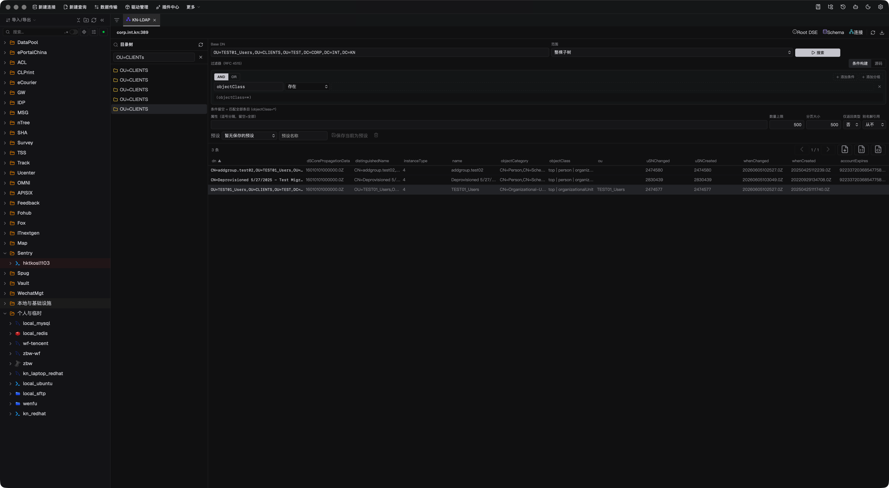

# LDAP Studio

[](https://github.com/jinpy666/dbx-plugin-ldap/actions/workflows/ci.yml)
[](https://github.com/jinpy666/dbx-plugin-ldap/releases)
[](LICENSE)

[中文](README.md) · [Product page](docs/MEDIA.en.md) · [Feature & competitor comparison](docs/COMPARISON.en.md) · [Standalone repo migration](docs/REPOSITORY_SPLIT.en.md)

**LDAP Studio** is the LDAP directory workspace for DBX (plugin id
`io.dbx.ldap`): open one connection and get directory browsing, guarded entry
maintenance, schema inspection, and MCP automation in a single, auditable
workflow — find anything, change it safely, and hand tasks to AI without
losing control.

> Browse · Guarded editing · Automation: directory lookups, entry maintenance,
> and AI automation live in one DBX directory panel.




## Up and running in a minute

1. **Install**: download the `.dbxp` package for your platform from
   [Releases](https://github.com/jinpy666/dbx-plugin-ldap/releases) and install
   it from the DBX plugin center. The Go sidecar ships inside the package with
   zero external dependencies, covering macOS (Apple Silicon / Intel),
   Linux (x64 / ARM64), and Windows (x64).
2. **Connect**: enter the server host and pick an authentication mode (choose
   Kerberos/GSSAPI or NTLM for corporate AD); enable StartTLS/LDAPS when you
   need encryption. Custom CAs, SNI overrides, and client-certificate mTLS all
   have a field ready.
3. **Work**: browse the DN tree, save your frequent searches as presets, edit
   entries behind the guards, and export LDIF/CSV for delivery.

## Why it is worth using

| What you need to do | What LDAP Studio gives you |
| --- | --- |
| Find users, groups, and service accounts fast | DN tree browsing, paged searches, RFC 4515 filters, reusable presets — or paste an `ldapsearch` command to import search criteria in one step |
| Maintain entries without fear | View, create, edit, rename, and delete — every write passes read-only mode, Base DN allowlists, and blocked attributes, and leaves an audit record |
| Connect to any enterprise directory | 8 authentication modes from anonymous and simple to Kerberos/GSSAPI, NTLM, DIGEST-MD5, and SASL External — OpenLDAP and Active Directory alike |
| Keep the transport encrypted | LDAP / StartTLS / LDAPS / ldapi with certificate validation, custom CAs, SNI overrides, and mTLS client certificates |
| Audit directory structure and capabilities | RootDSE, schema, and attribute metadata inspection; the server info dialog adds ping, TLS mode, and RFC descriptions for control/extension OIDs |
| Export audit or delivery data | LDIF and CSV export that preserves DN semantics |
| Let AI help with directory ops | 8 MCP tools that reuse saved connections and guards, with mandatory two-phase confirmation for deletes and renames |

## Support matrix

Don't take our word for "enterprise directory support" — here is the full
list of protocols, authentication mechanisms, and directory servers, each
backed by a working implementation:

**Transports & encryption**

| Method | Notes |
| --- | --- |
| `ldap://` | Plaintext LDAP, default port 389 |
| `ldaps://` | TLS, default port 636 |
| StartTLS | Upgrade a plaintext port to encrypted |
| `ldapi://` | Unix domain socket for local directory IPC — enter the full ldapi URL as the server host |
| Host tunnel / proxy | Reach intranet or remote directories through the DBX host channel |

TLS details: certificate validation is optional; custom CA paths, server name
(SNI) overrides, and mTLS client certificates are all supported.

**Authentication & SASL mechanisms (8)**

| Mechanism | Highlights |
| --- | --- |
| Anonymous | Zero-credential browsing |
| Simple | Bind DN, AD login name, or UPN |
| Unauthenticated | Sends the DN without a password, per the RFC |
| Kerberos (GSSAPI) | Password / keytab / ccache credentials; realm & KDC overrides, explicit or auto-generated krb5.conf, QoP, and mutual authentication |
| NTLM | `DOMAIN\user` logins against Active Directory |
| NTLM hash | Connect with the NT hash directly — no plaintext password needed |
| DIGEST-MD5 | Optional SASL host override |
| SASL EXTERNAL | Bind as the certificate identity, paired with mTLS client certs |

**LDAP protocol capabilities**

| Capability | Spec |
| --- | --- |
| Paged search with cursor | RFC 2696 |
| Server-side sorting | RFC 2891 |
| RootDSE / schema / attribute metadata | RFC 4512 |
| Who Am I? identity check | RFC 4532 |
| Password Modify (dedicated password editor) | RFC 3062 |
| LDIF import & export | RFC 2849 |
| Filter syntax | RFC 4515 |
| `ldapsearch` command import | Paste and parse |

**Directory server support**

| Directory | Notes |
| --- | --- |
| Microsoft Active Directory | `DOMAIN\user` and UPN logins, full Kerberos credentials, `objectGUID`/`objectSid`/FILETIME binary decoding, write protection for `unicodePwd` and other password attributes |
| OpenLDAP | 2.6 integration tests in real containers across plaintext / StartTLS / LDAPS / `ldapi` socket transports |
| Other LDAPv3 servers | 389 Directory Server, ApacheDS, Samba AD, eDirectory, and more, via standard v3 connections |

## Use cases

- Everyday lookups, account inventories, and group membership audits against
  corporate AD / OpenLDAP directories.
- Entry maintenance inside approved Base DN scopes, followed by delivery
  exports.
- Inspecting directory schema, attribute definitions, and RootDSE capabilities
  before imports.
- Letting an AI assistant run directory sweeps and changes through the DBX MCP
  bridge — with the guards and human confirmation still in the loop.

## Highlights

- **Search**: DN tree browsing, RFC 4515 filters, and saved presets; RFC 2696
  paging with cursor iteration and RFC 2891 server-side sorting keep large
  directories responsive. Paste an `ldapsearch` command to import base DN,
  scope, filter, attributes, and size limit in one step — bind and connection
  options are dropped in favour of the saved connection and guards.
- **Entry maintenance**: view, create, edit, rename, and delete; password-type
  attributes get a dedicated editor (RFC 3062 Password Modify). Everything is
  subject to read-only mode, read/write Base DN allowlists, and blocked
  attributes; `userPassword`, `unicodePwd`, and other sensitive attributes are
  blocked by default, and every write path leaves an audit record.
- **Authentication matrix**: anonymous, unauthenticated, simple,
  Kerberos/GSSAPI (password / keytab / ccache credentials, realm and KDC
  overrides, krb5.conf path, GSSAPI QoP, and mutual authentication), NTLM,
  NTLM hash, DIGEST-MD5, and SASL External.
- **Transport security**: LDAP, StartTLS, and LDAPS, plus `ldapi://` Unix
  sockets for local directories; certificate validation is optional and pairs
  with a custom CA path, server name (SNI) override, and mTLS client
  certificates; the dial timeout can be tuned independently of operation
  timeouts.
- **Schema & diagnostics**: RootDSE, schema, and attribute metadata inspection;
  a one-click Who Am I? (RFC 4532) check of the current bind identity; the
  server info dialog adds connection status, ping, TLS mode, and RFC
  descriptions for control/extension OIDs.
- **Request log panel**: open a log stream docked in the DBX bottom panel from
  the app toolbar or command palette (same mechanism as the built-in
  terminal): every LDAP request (searches, entry maintenance, MCP calls) and
  connection lifecycle event appears live with duration, result, and filter
  summary; filter by level/connection, substring query, auto-scroll, and
  one-click copy. While the panel is closed the sidecar ring buffer keeps
  recent entries and backfills on reopen; credentials and sensitive attribute
  values never enter the log.
- **Import & export**: LDIF import and export (RFC 2849) plus CSV export that
  preserve DN semantics and field types.
- **Localization**: Simplified Chinese, Traditional Chinese, English, Spanish,
  Italian, Japanese, and Portuguese, with light/dark themes that follow the
  host.

For the full capability matrix and how LDAP Studio compares with ldapsearch,
Apache Directory Studio, and JXplorer, see
[Feature & competitor comparison](docs/COMPARISON.en.md).

## MCP automation

Prefer the DBX MCP bridge so saved connections and guards are reused. Standalone
stdio mode can be started with:

```bash
backend/bin/dbx-plugin-ldap --mcp
```

The tool surface has 8 tools: `ldap_search_digest` (locally aggregated reads
with cursor paging), `ldap_cursor_next`, `ldap_entry_write` (two-phase
confirmation for deletes and renames), `ldap_ui_schema`, plus the workbench
tools `ldap_ui_search` / `ldap_ui_focus` / `ldap_ui_select` / `ldap_ui_state`.
AI sees the same guards as a human operator: read-only mode, Base DN
allowlists, and blocked attributes all apply on the MCP path. See the
[MCP usage guide](docs/MCP_USAGE.en.md) for setup, parameters, and safety
boundaries; the protocol-level
[LDAP MCP reference](docs/MCP.zh-CN.md) is available in Chinese.

## Security

Bind passwords, Kerberos credentials, and other sensitive values are managed by
DBX host secret bindings; the plugin never persists them, and MCP tool arguments
never carry passwords. For production connections, enable TLS verification,
read-only mode, and the narrowest practical read/write Base DN scopes. All write
paths leave audit records, and MCP deletes and renames require two-phase
confirmation.

## Install

Requires DBX `>= 0.5.77`. Download the `.dbxp` package matching your host
platform (darwin-arm64 / darwin-x64 / linux-x64 / linux-arm64 / windows-x64)
from [GitHub Releases](https://github.com/jinpy666/dbx-plugin-ldap/releases)
and install it from the DBX plugin center. The sidecar backend ships inside the
package; no extra dependencies are required.

## Development

This repository is self-contained: the frontend host-adaptation layer lives in
`shared/frontend/` and the Go sidecar SDK in `shared/sdk/go/`; neither the
monorepo nor a host worktree is required.

```bash
scripts/test.sh        # form contract + frontend three-step + go vet/test + package + smoke (SKIPs without container environments)
scripts/build.sh       # frontend build + sidecar build + .dbxp packaging (artifacts in dist/; stale artifacts pruned, --skip-tests for fast iteration)
scripts/install.sh     # install the newest .dbxp into DBX via the official installer and drop old versions (--reinstall / --no-restart / --keep-old)
scripts/clean.sh       # prune stale dist/ artifacts, backend/bin and __pycache__ (--all clears current artifacts too)
```

Or run layers individually:

```bash
node scripts/connection-forms/verify.mjs ldap
pnpm --dir frontend install --frozen-lockfile && pnpm --dir frontend typecheck && pnpm --dir frontend test
(cd backend && go vet ./... && go test ./...)
python3 scripts/smoke_mcp.py   # offline MCP smoke; live OpenLDAP container cases SKIP without an environment
```

## Documentation

- [Product page](docs/MEDIA.en.md): positioning, feature highlights, typical
  workflows, and FAQ.
- [Feature & competitor comparison](docs/COMPARISON.en.md): where LDAP Studio
  stands versus ldapsearch, Apache Directory Studio, and JXplorer.
- [MCP usage guide](docs/MCP_USAGE.en.md): DBX MCP bridge or standalone stdio.
- [LDAP MCP reference](docs/MCP.zh-CN.md): protocol methods, tool parameters,
  and degradation matrix (Chinese).
- [Standalone repo migration](docs/REPOSITORY_SPLIT.en.md): repo boundaries and
  release prerequisites.
- The implementation plan and progress notes live under `docs/`.
