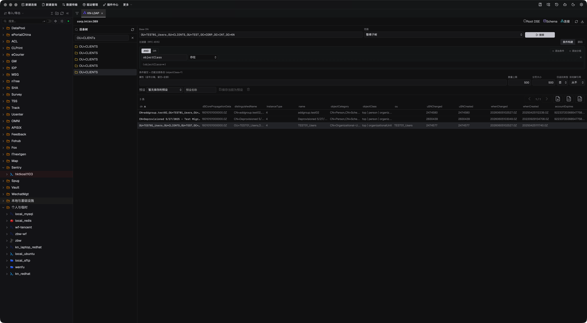

# LDAP Studio

[](https://github.com/jinpy666/dbx-plugin-ldap/actions/workflows/ci.yml)
[](https://github.com/jinpy666/dbx-plugin-ldap/releases)

[English](README.en.md) · [产品宣传页](docs/MEDIA.zh-CN.md) · [特性与竞品对比](docs/COMPARISON.zh-CN.md) · [独立仓库迁移说明](docs/REPOSITORY_SPLIT.zh-CN.md)

LDAP Studio 是 DBX 的 LDAP 目录工作台（插件 id `io.dbx.ldap`）：打开一个连接，
就能完成目录浏览、条目维护、Schema 检查和 MCP 自动化。它把"连上目录之后的
每一步"收进一个连贯、受护栏、可审计的工作流。

> LDAP Directory · Guarded Editing · Automation：浏览、编辑、审计和 AI 自动化
> 集中在同一个 DBX 目录面板中。




## 为什么值得用

| 你要完成的事 | LDAP Studio 给你的体验 |
| --- | --- |
| 快速定位用户、组和服务账号 | DN 树浏览、分页搜索、RFC 4515 过滤器和可复用的搜索预设 |
| 安全地维护目录条目 | 查看、新增、编辑、重命名、删除，全程过 Base DN 白名单与屏蔽属性护栏 |
| 接入企业目录的各类认证 | anonymous、simple、Kerberos/GSSAPI、NTLM、DIGEST-MD5、SASL External 等认证矩阵 |
| 核查目录结构与能力 | RootDSE、Schema 与属性元数据检查 |
| 导出审计或交付数据 | LDIF 和 CSV 导出，保留字段与 DN 语义 |
| 让 AI 参与目录运维 | 8 个 MCP 工具复用连接、护栏与两阶段写确认 |

## 适合场景

- 企业 AD / OpenLDAP 目录的日常查询、账号盘点和组成员审计。
- 在审批后的 Base DN 范围内完成条目维护，并导出交付数据。
- 检查目录 Schema、属性定义和 RootDSE 能力，为导入做准备。

## 核心能力

- DN 树浏览、分页搜索和 RFC 4515 过滤器，支持保存搜索预设。
- 直接粘贴 `ldapsearch` 命令导入搜索条件：Base DN、范围、过滤器、属性和数量
  上限一键落表；绑定/连接参数自动忽略，始终沿用已保存连接与护栏。
- 目录条目的查看、新增、编辑、重命名和删除。
- RootDSE、Schema 和属性元数据检查。
- LDIF 和 CSV 导出。
- 认证矩阵：anonymous、unauthenticated、simple、Kerberos/GSSAPI、NTLM、
  NTLM 哈希、DIGEST-MD5 和 SASL External。
- 传输安全：LDAP、StartTLS 和 LDAPS，可配置 TLS 校验、CA 路径和服务器名称。
- 安全护栏：只读模式、允许写入的 Base DN 白名单、屏蔽属性和审计记录。
- 界面支持简体中文、繁体中文、英语、西班牙语、意大利语、日语和葡萄牙语。

完整的能力矩阵和与 ldapsearch、Apache Directory Studio、JXplorer 等工具的
定位对比见[特性与竞品对比](docs/COMPARISON.zh-CN.md)。

## MCP 自动化

推荐通过 DBX MCP 桥调用，以复用已保存连接和护栏。独立 stdio 模式可运行：

```bash
backend/bin/dbx-plugin-ldap --mcp
```

工具面共 8 个：`ldap_search_digest`（本地聚合读 + cursor 翻页）、
`ldap_cursor_next`、`ldap_entry_write`（删除/改名两阶段确认）、
`ldap_ui_schema`，以及面向 DBX 工作台的 `ldap_ui_search` / `ldap_ui_focus` /
`ldap_ui_select` / `ldap_ui_state`。接入方式、参数语义和安全边界见
[MCP 使用指南](docs/MCP_USAGE.zh-CN.md)，协议细节见
[LDAP MCP 参考](docs/MCP.zh-CN.md)。

## 安全设计

绑定密码、Kerberos 凭据和其他敏感信息由 DBX 宿主 secret binding 管理，插件
不持久化凭据，MCP 工具参数中也不出现密码。生产连接建议启用 TLS 校验、只读
模式和最小化的读写 Base DN 范围；所有写路径落审计记录。

## 安装

从 [GitHub Releases](https://github.com/jinpy666/dbx-plugin-ldap/releases) 下载
与宿主平台匹配的 `.dbxp` 安装包，在 DBX 插件中心选择本地安装即可；sidecar
后端随包分发，无需额外依赖。

## 开发与验证

本仓库自包含：前端宿主适配层位于 `shared/frontend/`，Go sidecar SDK 位于
`shared/sdk/go/`，不依赖 monorepo 或宿主工作区。

```bash
scripts/test.sh        # 连接表单校验 + 前端三件套 + go vet/test + 打包 + smoke（无容器环境自动 SKIP）
scripts/build.sh       # 前端构建 + sidecar 构建 + .dbxp 打包（产物在 dist/）
```

也可以分层执行：

```bash
node scripts/connection-forms/verify.mjs ldap
pnpm --dir frontend install --frozen-lockfile && pnpm --dir frontend typecheck && pnpm --dir frontend test
(cd backend && go vet ./... && go test ./...)
python3 scripts/smoke_mcp.py   # 离线 MCP smoke；真实 OpenLDAP 容器类用例无环境时 SKIP
```

## 文档

- [产品宣传页](docs/MEDIA.zh-CN.md)：定位、亮点特性、典型工作流与 FAQ。
- [特性与竞品对比](docs/COMPARISON.zh-CN.md)：与 ldapsearch、Apache Directory
  Studio、JXplorer 的定位对比。
- [MCP 使用指南](docs/MCP_USAGE.zh-CN.md)：接入 DBX MCP 桥或独立 stdio 模式。
- [LDAP MCP 参考](docs/MCP.zh-CN.md)：协议方法、工具参数与降级矩阵。
- [独立仓库迁移说明](docs/REPOSITORY_SPLIT.zh-CN.md)：仓库边界与发布前置条件。
- [实施计划](docs/IMPL_PLAN_DBX_LDAP.zh-CN.md)与进度记录位于 `docs/`。
